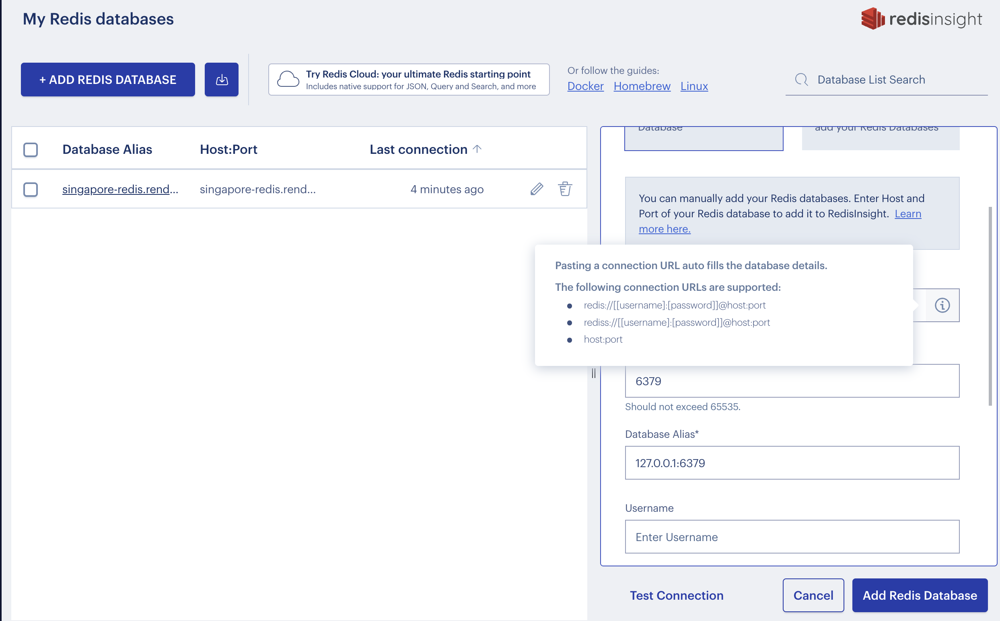

# redis_python
### redis_server的安裝
[參考官網](https://redis.io/docs/getting-started/installation/)

### python操控redis
[參考來源](https://redis.readthedocs.io/en/stable/examples.html)

### 安裝redis GUI(redisInsight)
https://redis.com/redis-enterprise/redis-insight/

### redisInsight加入redis server
- 不要單獨設,不好連線
- 一次填入redis提供的密碼(如下圖)



### 安裝redis套件

```
$ pip install redis 
```


### 連線至Render

```
renderRedis = redis.Redis.from_url('rediss://xxxxxxxxxxxxxxxxxxxxxxxxxxxxxxxxxxx:6379')
```

### 連線redis,密碼儲存於環境變數內
- 使用python-dotenv套件

```
pip install -U python-dotenv
```

- 在專案資料夾內建立.env檔

```
REDIS_HOST_PASSWORD=xxxxxxxxxxx
```

> 注意: **=** 的左,右2邊不可以有空白

- 在專案內加入以下程式

```python
import redis
import os
from dotenv import load_dotenv

load_dotenv()
user_connection = redis.Redis(host='localhost', port=6379, password=os.environ['REDIS_HOST_PASSWORD'], decode_responses=True)

user_connection.ping()

結果================
True
```

# redis的功能
### 1. [string的使用](./String的使用/)
### 2. [list的使用](./list的使用/)
### 3. [hash的使用](./hash的使用/)
### 4. [set的使用](./set的使用/)
### 5. [使用redis儲存複雜資料](./複雜資料架構)
# redis_stack專有的功能
## 5. [json的使用](./json的使用/)

